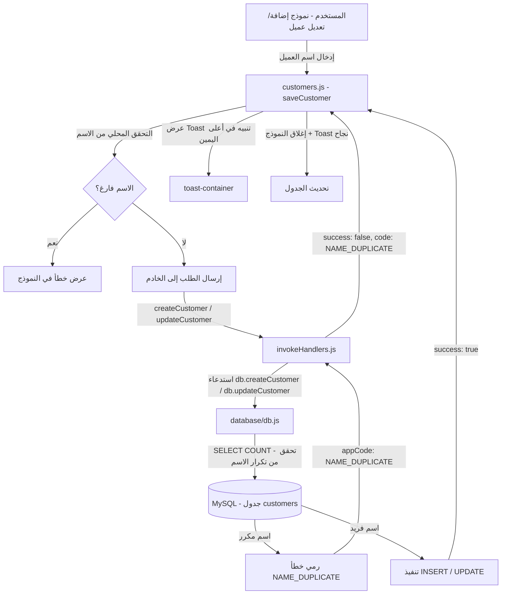
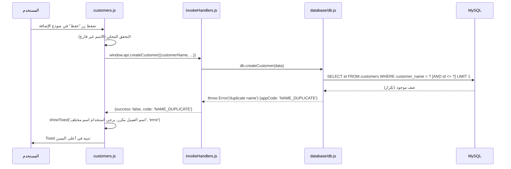
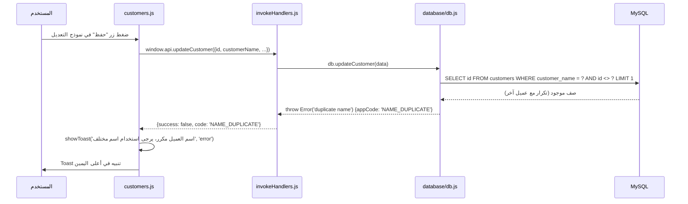

# وثيقة التصميم: منع تكرار اسم العميل (customer-name-uniqueness)

## نظرة عامة

تهدف هذه الميزة إلى منع تكرار اسم العميل في شاشة العملاء، سواء عند إضافة عميل جديد أو تعديل عميل موجود. عند اكتشاف تكرار في الاسم، يُمنع الحفظ وتظهر رسالة تنبيه (Toast) في أعلى الشاشة جهة اليمين توضح أن الاسم مكرر.

يعتمد النظام على بنية Client-Server حيث يتم التحقق على مستوى قاعدة البيانات (MySQL) عبر طبقة `database/db.js`، ويُعاد الخطأ عبر `server/invokeHandlers.js` إلى الواجهة الأمامية `screens/customers/customers.js`.

---

## المعمارية



---

## مخططات التسلسل

### سيناريو: إضافة عميل باسم مكرر



### سيناريو: تعديل عميل باسم مكرر



---

## المكونات والواجهات

### المكون 1: database/db.js

**الغرض**: التحقق من تفرد اسم العميل على مستوى قاعدة البيانات قبل الإدراج أو التحديث.

**الدوال المعدّلة**:

```javascript
// createCustomer - إضافة تحقق من تكرار الاسم
async function createCustomer(data) {
  // ... الكود الحالي ...
  // إضافة: التحقق من تكرار الاسم
  const [[nameDup]] = await pool.query(
    'SELECT id FROM customers WHERE customer_name = ? LIMIT 1',
    [customerName]
  );
  if (nameDup) {
    const e = new Error('duplicate name');
    e.appCode = 'NAME_DUPLICATE';
    throw e;
  }
  // ... باقي الكود ...
}

// updateCustomer - إضافة تحقق من تكرار الاسم (مع استثناء العميل الحالي)
async function updateCustomer(data) {
  // ... الكود الحالي ...
  // إضافة: التحقق من تكرار الاسم
  const [[nameDup]] = await pool.query(
    'SELECT id FROM customers WHERE customer_name = ? AND id <> ? LIMIT 1',
    [customerName, cid]
  );
  if (nameDup) {
    const e = new Error('duplicate name');
    e.appCode = 'NAME_DUPLICATE';
    throw e;
  }
  // ... باقي الكود ...
}
```

**المسؤوليات**:
- استعلام قاعدة البيانات للتحقق من وجود اسم مطابق
- رمي خطأ بكود `NAME_DUPLICATE` عند وجود تكرار
- استثناء العميل الحالي عند التعديل (مقارنة `id <> cid`)

---

### المكون 2: server/invokeHandlers.js

**الغرض**: التقاط خطأ `NAME_DUPLICATE` من طبقة قاعدة البيانات وإعادته للواجهة الأمامية.

**الكود المعدّل**:

```javascript
case 'createCustomer': {
  try {
    const result = await db.createCustomer(payload);
    return { success: true, ...result };
  } catch (err) {
    if (err.appCode === 'NAME_DUPLICATE')  return { success: false, code: 'NAME_DUPLICATE' };
    if (err.appCode === 'PHONE_DUPLICATE') return { success: false, code: 'PHONE_DUPLICATE' };
    if (err.appCode === 'PHONE_INVALID')   return { success: false, code: 'PHONE_INVALID' };
    if (err.appCode === 'PHONE_TOO_LONG')  return { success: false, code: 'PHONE_TOO_LONG' };
    return { success: false, message: err.message };
  }
}

case 'updateCustomer': {
  try {
    await db.updateCustomer(payload);
    return { success: true };
  } catch (err) {
    if (err.appCode === 'NAME_DUPLICATE')  return { success: false, code: 'NAME_DUPLICATE' };
    if (err.appCode === 'PHONE_DUPLICATE') return { success: false, code: 'PHONE_DUPLICATE' };
    if (err.appCode === 'PHONE_INVALID')   return { success: false, code: 'PHONE_INVALID' };
    if (err.appCode === 'PHONE_TOO_LONG')  return { success: false, code: 'PHONE_TOO_LONG' };
    return { success: false, message: err.message };
  }
}
```

**المسؤوليات**:
- التقاط `appCode === 'NAME_DUPLICATE'` وإعادة `{ success: false, code: 'NAME_DUPLICATE' }`
- الحفاظ على معالجة الأخطاء الأخرى الموجودة

---

### المكون 3: screens/customers/customers.js

**الغرض**: معالجة استجابة `NAME_DUPLICATE` من الخادم وعرض Toast تنبيه للمستخدم.

**الكود المعدّل في دالة `saveCustomer`**:

```javascript
async function saveCustomer() {
  // ... الكود الحالي للتحقق المحلي ...
  if (!customerName) {
    showModalError(I18N.t('customers-err-name'));
    return;
  }

  // ... إرسال الطلب ...
  if (result.success) {
    closeModal();
    showToast(id ? I18N.t('customers-success-update') : I18N.t('customers-success-add'), 'success');
    await loadCustomers();
  } else {
    const codeMsg =
      result.code === 'NAME_DUPLICATE'
        ? I18N.t('customers-err-name-duplicate')
        : result.code === 'PHONE_DUPLICATE'
          ? I18N.t('customers-err-phone-duplicate')
          : /* ... باقي الأكواد ... */
            null;
    // عرض Toast بدلاً من خطأ النموذج لـ NAME_DUPLICATE
    if (result.code === 'NAME_DUPLICATE') {
      showToast(I18N.t('customers-err-name-duplicate'), 'error');
    } else {
      showModalError(codeMsg || result.message || I18N.t('customers-err-unexpected'));
    }
  }
}
```

**المسؤوليات**:
- التحقق المحلي من أن اسم العميل غير فارغ قبل الإرسال
- معالجة كود `NAME_DUPLICATE` من الخادم
- عرض Toast تنبيه في أعلى الشاشة جهة اليمين (باستخدام `showToast` الموجودة)
- إبقاء النموذج مفتوحاً ليتمكن المستخدم من تعديل الاسم

---

## نماذج البيانات

### نموذج الخطأ المُعاد من الخادم

```javascript
// استجابة تكرار الاسم
{
  success: false,
  code: 'NAME_DUPLICATE'
  // لا يوجد message - يُترجم في الواجهة
}
```

### مفاتيح الترجمة المضافة (i18n)

```javascript
// مفاتيح جديدة تُضاف إلى نظام I18N
'customers-err-name'           // "اسم العميل مطلوب"
'customers-err-name-duplicate' // "اسم العميل مكرر، يرجى استخدام اسم مختلف"
```

**قواعد التحقق**:
- `customerName` يجب أن يكون غير فارغ بعد `trim()`
- المقارنة في قاعدة البيانات تعتمد على `utf8mb4_unicode_ci` (غير حساسة لحالة الأحرف اللاتينية)
- عند التعديل: يُستثنى العميل الحالي من التحقق (`id <> cid`)

---

## معالجة الأخطاء

### سيناريو 1: اسم مكرر عند الإضافة

**الشرط**: `customer_name` موجود مسبقاً في جدول `customers`
**الاستجابة**: `{ success: false, code: 'NAME_DUPLICATE' }`
**التعافي**: يبقى النموذج مفتوحاً، يظهر Toast خطأ، يمكن للمستخدم تعديل الاسم

### سيناريو 2: اسم مكرر عند التعديل

**الشرط**: `customer_name` موجود في عميل آخر (`id <> cid`)
**الاستجابة**: `{ success: false, code: 'NAME_DUPLICATE' }`
**التعافي**: نفس سيناريو الإضافة

### سيناريو 3: اسم فارغ (تحقق محلي)

**الشرط**: `customerName.trim() === ''`
**الاستجابة**: خطأ محلي في النموذج (لا يُرسل طلب للخادم)
**التعافي**: يظهر خطأ داخل النموذج تحت حقل الاسم

### سيناريو 4: تعديل العميل بنفس اسمه الحالي

**الشرط**: المستخدم يحفظ بدون تغيير الاسم
**الاستجابة**: `success: true` (لأن الاستعلام يستثني `id = cid`)
**التعافي**: لا يوجد خطأ، يتم الحفظ بنجاح

---

## استراتيجية الاختبار

### اختبار الوحدة

- اختبار `createCustomer` مع اسم موجود → يجب أن يرمي `NAME_DUPLICATE`
- اختبار `createCustomer` مع اسم جديد → يجب أن ينجح
- اختبار `updateCustomer` مع اسم موجود لعميل آخر → يجب أن يرمي `NAME_DUPLICATE`
- اختبار `updateCustomer` مع نفس اسم العميل الحالي → يجب أن ينجح

### اختبار الواجهة الأمامية

- التحقق من ظهور Toast عند استقبال `NAME_DUPLICATE`
- التحقق من بقاء النموذج مفتوحاً بعد الخطأ
- التحقق من عدم إرسال طلب عند اسم فارغ

### خصائص الصحة (Correctness Properties)

- **∀ عميل c1، c2 في قاعدة البيانات**: إذا `c1.id ≠ c2.id` فإن `c1.customer_name ≠ c2.customer_name` (بعد الحفظ الناجح)
- **∀ طلب إضافة**: إذا كان الاسم موجوداً → `success = false` و `code = 'NAME_DUPLICATE'`
- **∀ طلب تعديل**: إذا كان الاسم موجوداً في عميل آخر → `success = false` و `code = 'NAME_DUPLICATE'`
- **∀ طلب تعديل**: إذا كان الاسم هو نفس اسم العميل الحالي → `success = true`

---

## اعتبارات الأداء

- الاستعلام `SELECT id FROM customers WHERE customer_name = ? LIMIT 1` يستفيد من الفهرس الموجود `idx_customers_search` الذي يشمل عمود `customer_name`
- لا يوجد تأثير على الأداء العام لأن التحقق يتم فقط عند الحفظ (وليس عند كل ضغطة مفتاح)

## اعتبارات الأمان

- التحقق يتم على مستوى الخادم وقاعدة البيانات (وليس فقط الواجهة الأمامية)
- استخدام Prepared Statements يمنع SQL Injection
- لا تُكشف تفاصيل قاعدة البيانات للمستخدم (فقط كود الخطأ)

---

## التبعيات

- **MySQL** مع `utf8mb4_unicode_ci` (موجود)
- **نظام I18N** في `assets/i18n.js` (موجود) - يحتاج إضافة مفاتيح جديدة
- **نظام Toast** في `customers.js` (موجود) - يُستخدم كما هو
- **نظام `appCode`** في `db.js` (موجود، مستخدم لـ `PHONE_DUPLICATE`) - يُوسَّع ليشمل `NAME_DUPLICATE`

---

## خصائص الصحة

*الخاصية هي سلوك يجب أن يصمد عبر جميع حالات التنفيذ الصحيحة للنظام — وهي جسر بين المواصفات المقروءة بشرياً وضمانات الصحة القابلة للتحقق آلياً.*

### الخاصية 1: رفض الاسم الفارغ أو المكوّن من مسافات

*لأي* سلسلة نصية مكوّنة بالكامل من مسافات أو فارغة تماماً، يجب أن يرفض النظام إرسال طلب الحفظ ويبقى حجم قائمة العملاء دون تغيير.

**Validates: Requirements 1.1**

---

### الخاصية 2: رفض الاسم المكرر عند الإضافة

*لأي* اسم عميل موجود مسبقاً في قاعدة البيانات، يجب أن تُعيد `Database_Layer` خطأ بـ `appCode` يساوي `NAME_DUPLICATE` عند محاولة إدراج عميل جديد بنفس الاسم.

**Validates: Requirements 2.1**

---

### الخاصية 3: رفض الاسم المكرر عند التعديل

*لأي* عميلين بـ `id` مختلفين، يجب أن تُعيد `Database_Layer` خطأ بـ `appCode` يساوي `NAME_DUPLICATE` عند محاولة تحديث أحدهما ليحمل اسم الآخر.

**Validates: Requirements 2.3**

---

### الخاصية 4: نجاح التعديل بنفس الاسم الحالي

*لأي* عميل موجود، يجب أن تنجح عملية `updateCustomer` عند تمرير نفس `customer_name` الحالي للعميل (بدون تغيير الاسم).

**Validates: Requirements 2.4**

---

### الخاصية 5: عرض Toast عند استقبال NAME_DUPLICATE

*لأي* استجابة `{ success: false, code: 'NAME_DUPLICATE' }` من الخادم، يجب أن تعرض `UI` Toast تنبيه من نوع `error` وتُبقي النموذج مفتوحاً.

**Validates: Requirements 4.1, 4.2**

---

### الخاصية 6: تفرد أسماء العملاء بعد كل عملية حفظ ناجحة

*لأي* تسلسل من عمليات `createCustomer` و `updateCustomer` الناجحة، يجب أن تكون جميع قيم `customer_name` في جدول `customers` فريدة (لا يوجد عميلان بنفس الاسم).

**Validates: Requirements 5.1, 5.2**
