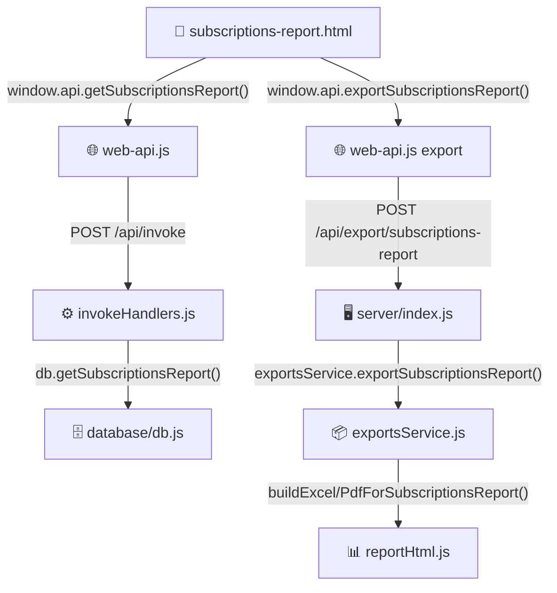

# تقرير الاشتراكات — Subscriptions Report: Implementation Plan

> **نظام المغسلة السعودي** | Laundry Management System — Saudi Arabia
> **Tech Stack**: Node.js / Express · MySQL · Vanilla JS · Tailwind CSS (RTL Arabic)

---

## معمارية النظام — Architecture Overview



---

## الملفات الجديدة — New Files to Create

```
screens/reports/subscriptions-report/
  ├── subscriptions-report.html
  ├── subscriptions-report.js
  └── subscriptions-report.css
```

---

## 1. قاعدة البيانات — Database (`database/db.js`)

### 1.1 دالة جديدة: `getSubscriptionsReport(filters)`

أضف بعد دالة `getCustomerSubscriptionsList` (~السطر 1688).

**معاملات الفلترة:**
```js
const {
  customerId,    // INT — تصفية لعميل واحد
  search,        // string — اسم العميل / الجوال / رقم الاشتراك
  statusFilter,  // 'active' | 'expired' | 'closed' | 'negative' | 'near_expiry' | 'all'
  packageId,     // INT — تصفية حسب الباقة
  dateFrom,      // DATE 'YYYY-MM-DD' — period_from >= dateFrom
  dateTo,        // DATE 'YYYY-MM-DD' — period_to <= dateTo
} = filters;
```

**استعلام SQL التفصيلي:**
```sql
SELECT
  sp.id                                           AS period_id,
  cs.id                                           AS subscription_id,
  cs.subscription_ref,
  c.id                                            AS customer_id,
  c.customer_name,
  c.phone,
  c.subscription_number                           AS customer_file_ref,
  pp.id                                           AS package_id,
  pp.name_ar                                      AS package_name,
  pp.prepaid_price,
  pp.service_credit_value,
  sp.period_from,
  sp.period_to,
  sp.prepaid_price_paid,
  sp.credit_value_granted,
  sp.credit_remaining,
  sp.status                                       AS period_status,
  DATEDIFF(sp.period_to, CURDATE())               AS days_until_expiry,
  CASE
    WHEN sp.status = 'active' AND sp.period_to IS NULL      THEN 'active'
    WHEN sp.status = 'active' AND sp.period_to >= CURDATE() THEN 'active'
    WHEN sp.status = 'active' AND sp.period_to < CURDATE()  THEN 'expired'
    WHEN sp.status = 'expired'                              THEN 'expired'
    WHEN sp.status = 'closed'                               THEN 'closed'
    ELSE 'none'
  END                                             AS display_status
FROM subscription_periods sp
INNER JOIN customer_subscriptions cs ON cs.id = sp.customer_subscription_id
INNER JOIN customers c               ON c.id  = cs.customer_id
INNER JOIN prepaid_packages pp       ON pp.id = sp.package_id
WHERE 1=1
  [+ شروط WHERE الديناميكية]
ORDER BY sp.id DESC
```

**استعلام التجميع والملخص** (يُشغَّل بالتوازي مع استعلام التفاصيل):
```sql
SELECT
  COUNT(*)                                                           AS total_periods,
  SUM(CASE WHEN sp.status='active'
            AND (sp.period_to IS NULL OR sp.period_to >= CURDATE())
            AND sp.credit_remaining > 0   THEN 1 ELSE 0 END)        AS active_count,
  SUM(CASE WHEN sp.status='expired'
            OR (sp.status='active' AND sp.period_to < CURDATE())
                                          THEN 1 ELSE 0 END)        AS expired_count,
  SUM(CASE WHEN sp.status='closed'        THEN 1 ELSE 0 END)        AS closed_count,
  SUM(CASE WHEN sp.status='active'
            AND sp.period_to IS NOT NULL
            AND DATEDIFF(sp.period_to, CURDATE()) BETWEEN 0 AND 7
                                          THEN 1 ELSE 0 END)        AS near_expiry_count,
  SUM(CASE WHEN sp.status='active'
            AND sp.credit_remaining <= 0  THEN 1 ELSE 0 END)        AS negative_count,
  COALESCE(SUM(sp.prepaid_price_paid), 0)                           AS total_revenue,
  COALESCE(SUM(sp.credit_value_granted), 0)                         AS total_credit_granted,
  COALESCE(SUM(CASE WHEN sp.status='active'
                    THEN sp.credit_remaining ELSE 0 END), 0)        AS total_credit_remaining
FROM subscription_periods sp
INNER JOIN customer_subscriptions cs ON cs.id = sp.customer_subscription_id
INNER JOIN customers c               ON c.id  = cs.customer_id
INNER JOIN prepaid_packages pp       ON pp.id = sp.package_id
WHERE 1=1
  [نفس شروط WHERE]
```

**شروط WHERE الديناميكية:**

| الفلتر | شرط SQL |
|--------|---------|
| `customerId` | `AND cs.customer_id = ?` |
| `search` | `AND (cs.subscription_ref LIKE ? OR c.customer_name LIKE ? OR c.phone LIKE ? OR c.subscription_number LIKE ?)` |
| `packageId` | `AND sp.package_id = ?` |
| `dateFrom` | `AND sp.period_from >= ?` |
| `dateTo` | `AND sp.period_to <= ?` |
| `statusFilter = 'active'` | `AND sp.status = 'active' AND (sp.period_to IS NULL OR sp.period_to >= CURDATE()) AND sp.credit_remaining > 0` |
| `statusFilter = 'expired'` | `AND (sp.status = 'expired' OR (sp.status = 'active' AND sp.period_to < CURDATE()))` |
| `statusFilter = 'closed'` | `AND sp.status = 'closed'` |
| `statusFilter = 'negative'` | `AND sp.credit_remaining <= 0 AND sp.status = 'active'` |
| `statusFilter = 'near_expiry'` | `AND sp.status = 'active' AND sp.period_to IS NOT NULL AND DATEDIFF(sp.period_to, CURDATE()) BETWEEN 0 AND 7` |

**شكل الإرجاع:**
```js
return {
  periods: [...],
  summary: {
    totalPeriods, activeCount, expiredCount, closedCount,
    nearExpiryCount, negativeCount,
    totalRevenue, totalCreditGranted, totalCreditRemaining
  }
};
```

**توقيع الدالة الكاملة:**
```js
async function getSubscriptionsReport(filters = {}) {
  await refreshExpiredSubscriptionPeriods();
  // بناء WHERE...
  const [[summaryRow], [periods]] = await Promise.all([
    pool.query(summarySql, summaryParams),
    pool.query(detailSql, detailParams)
  ]);
  return { periods, summary: { ...summaryRow[0] } };
}
```

أضف `getSubscriptionsReport` إلى `module.exports`.

---

## 2. معالج الاستدعاء — `server/invokeHandlers.js`

أضف `case` جديدة قبل الـ `default` case (~السطر 976):

```js
case 'getSubscriptionsReport': {
  try {
    const data = await db.getSubscriptionsReport(payload || {});
    return { success: true, ...data };
  } catch (err) {
    return { success: false, message: err.message };
  }
}
```

---

## 3. نقطة نهاية التصدير — `server/index.js`

أضف بعد نقطة نهاية `exportAllInvoicesReport` الموجودة (~السطر 242):

```js
app.post('/api/export/subscriptions-report', authMiddleware, async (req, res) => {
  try {
    const { type, filters = {} } = req.body || {};
    const result = await exportsService.exportSubscriptionsReport(type, filters);
    sendExport(res, result);
  } catch (err) {
    console.error(err);
    res.status(500).json({ success: false, message: err.message });
  }
});
```

---

## 4. واجهة برمجة التطبيقات — `assets/web-api.js`

أضف سطرين بعد إدخالات `getAllInvoicesReport` الموجودة (~السطر 308):

```js
getSubscriptionsReport:    (filters) => invoke('getSubscriptionsReport', filters),
exportSubscriptionsReport: (data)    => exportBinary('/api/export/subscriptions-report', data),
```

---

## 5. خدمة التصدير — `server/services/exportsService.js`

أضف دالة `exportSubscriptionsReport` بعد `exportAllInvoicesReport` (~السطر 618):

```js
async function exportSubscriptionsReport(type, filters = {}) {
  const data = await db.getSubscriptionsReport(filters);
  const f = cairoFonts();

  if (type === 'excel') {
    const wb = XLSX.utils.book_new();
    const sheets = reportHtml.buildExcelDataForSubscriptionsReport(data, filters);
    sheets.forEach(({ name, rows, cols, freezeRow }) => {
      const ws = XLSX.utils.aoa_to_sheet(rows);
      ws['!cols'] = cols;
      ws['!sheetViews'] = [{
        rightToLeft: true,
        state: freezeRow ? 'frozen' : undefined,
        ySplit: freezeRow || undefined,
        topLeftCell: freezeRow ? `A${freezeRow + 1}` : undefined
      }];
      XLSX.utils.book_append_sheet(wb, ws, name);
    });
    const buf = XLSX.write(wb, { type: 'buffer', bookType: 'xlsx' });
    return {
      buffer: Buffer.from(buf),
      filename: `subscriptions-report_${ts()}.xlsx`,
      mimeType: 'application/vnd.openxmlformats-officedocument.spreadsheetml.sheet'
    };
  }

  if (type === 'pdf') {
    const html = reportHtml.buildPdfHtmlForSubscriptionsReport(
      data, filters, f.cairoRegularB64, f.cairoBoldB64, f.saudiRiyalB64
    );
    const buffer = await htmlToPdfBuffer(html, { landscape: true });
    return { buffer, filename: `subscriptions-report_${ts()}.pdf`, mimeType: 'application/pdf' };
  }

  throw new Error('نوع التصدير غير مدعوم');
}
```

أضف `exportSubscriptionsReport` إلى `module.exports`.

---

## 6. بناة تقارير HTML — `server/services/reportHtml.js`

### 6.1 `buildExcelDataForSubscriptionsReport(data, filters)`

ترجع مصفوفة من واصفات الورقات:

**الورقة 1 — "فترات الاشتراكات"** (تفصيلية):

| العمود | العرض | المحتوى |
|--------|-------|---------|
| # | 4 | رقم الصف |
| رقم الملف | 14 | `customer_file_ref` |
| اسم العميل | 22 | `customer_name` |
| الجوال | 14 | `phone` |
| الباقة | 22 | `package_name` |
| من تاريخ | 12 | `period_from` منسّق |
| إلى تاريخ | 12 | `period_to` منسّق |
| المبلغ المدفوع (ر.س) | 16 | `prepaid_price_paid` |
| الرصيد الممنوح (ر.س) | 16 | `credit_value_granted` |
| الرصيد المتبقي (ر.س) | 16 | `credit_remaining` |
| الأيام المتبقية | 12 | `days_until_expiry` |
| الحالة | 12 | `display_status` → تسمية عربية |

- الصف 1: عنوان `تقرير الاشتراكات — نظام المغسلة`
- الصف 2: تاريخ الطباعة + الفلاتر المُطبَّقة
- الصف 4: إجماليات (إجمالي الفترات، إجمالي الإيراد)
- الصف 6+: الرؤوس (مجمَّدة عند الصف 6)
- الصف 7+: البيانات

**الورقة 2 — "ملخص"** (بطاقات KPI):

| البيان | العدد | المبلغ |
|--------|-------|--------|
| إجمالي الفترات | totalPeriods | totalRevenue |
| نشطة | activeCount | — |
| منتهية | expiredCount | — |
| مغلقة | closedCount | — |
| قريبة الانتهاء (7 أيام) | nearExpiryCount | — |
| رصيد سالب | negativeCount | — |
| إجمالي الرصيد الممنوح | — | totalCreditGranted |
| إجمالي الرصيد المتبقي | — | totalCreditRemaining |

### 6.2 `buildPdfHtmlForSubscriptionsReport(data, filters, cairoReg, cairoBold, saudiRiyal)`

تخطيط PDF (A4 أفقي):
- **الرأس**: العنوان، تاريخ الطباعة، معلومات الفلاتر
- **ملخص KPI**: شبكة 3 أعمدة من القيم
- **جدول تفصيلي**: نفس أعمدة ورقة Excel
- **التذييل**: اسم النظام وتاريخ الطباعة
- **نظام الألوان**: التدرج الفيروزي `#14b8a6 → #0d9488`

أضف كلا الدالتين إلى `module.exports` في `reportHtml.js`.

---

## 7. واجهة المستخدم — `screens/reports/subscriptions-report/`

### 7.1 `subscriptions-report.css`

اعتمد على `all-invoices-report.css` كأساس مع تغيير رموز الألوان:

| العنصر | اللون |
|--------|-------|
| خلفية `logo-icon` | `linear-gradient(135deg, #14b8a6, #0d9488)` (فيروزي) |
| `btn-apply` | `linear-gradient(90deg, #14b8a6, #0d9488)` |
| `period-info-bar` | درجات فيروزية |

**فئات CSS جديدة مطلوبة:**

```css
/* شبكة بطاقات KPI */
.kpi-grid { display: grid; grid-template-columns: repeat(auto-fill, minmax(160px, 1fr)); gap: 12px; }
.kpi-card { background: #fff; border: 1px solid #e2e8f0; border-radius: 12px; padding: 14px 16px; }
.kpi-label { font-size: 12px; color: #64748b; font-weight: 700; }
.kpi-value { font-size: 20px; font-weight: 700; color: #1e293b; }
.kpi-sub   { font-size: 11px; color: #94a3b8; }

/* حدود ملوّنة للبطاقات */
.kpi-active  { border-top: 3px solid #16a34a; }
.kpi-expired { border-top: 3px solid #dc2626; }
.kpi-near    { border-top: 3px solid #f59e0b; }
.kpi-neg     { border-top: 3px solid #ef4444; }
.kpi-revenue { border-top: 3px solid #0ea5e9; }
.kpi-credit  { border-top: 3px solid #8b5cf6; }

/* شارات الحالة */
.status-badge-active   { background:#dcfce7; color:#16a34a; padding:2px 8px; border-radius:20px; font-size:11px; font-weight:700; }
.status-badge-expired  { background:#fee2e2; color:#dc2626; padding:2px 8px; border-radius:20px; }
.status-badge-closed   { background:#f1f5f9; color:#64748b; padding:2px 8px; border-radius:20px; }
.status-badge-near     { background:#fef3c7; color:#d97706; padding:2px 8px; border-radius:20px; }
.status-badge-negative { background:#fee2e2; color:#dc2626; padding:2px 8px; border-radius:20px; }

/* منسدل بحث العميل */
.customer-search-wrap { position: relative; }
.customer-dropdown    { position: absolute; top: calc(100% + 4px); right: 0; left: 0;
                        background: #fff; border: 1px solid #e2e8f0; border-radius: 10px;
                        box-shadow: 0 4px 16px rgba(0,0,0,.12); z-index: 200; max-height: 200px; overflow-y: auto; }
.customer-dropdown-item { padding: 8px 14px; font-size: 13px; cursor: pointer; }
.customer-dropdown-item:hover { background: #f0fdfa; }

/* صف قريب الانتهاء */
tr.row-near-expiry { background: #fffbeb; }
.neg-val { color: #dc2626; font-weight: 700; }
```

### 7.2 `subscriptions-report.html` — هيكل HTML

```html
<!DOCTYPE html>
<html lang="ar" dir="rtl">
<head>
  <meta charset="UTF-8" />
  <title>تقرير الاشتراكات - نظام المغسلة</title>
  <link rel="stylesheet" href="../../../assets/tailwind.css" />
  <link rel="stylesheet" href="subscriptions-report.css" />
  <link rel="stylesheet" href="../../../assets/screen-mobile-compact.css" />
</head>
<body>
<div class="page-wrapper">

  <!-- ── شريط الرأس ── -->
  <header class="header-bar" id="dragRegion">
    <div class="header-right">
      <div class="header-logo">
        <div class="logo-icon"><!-- أيقونة اشتراك SVG --></div>
        <span class="header-title">تقرير الاشتراكات</span>
      </div>
    </div>
    <div class="header-left">
      <button class="btn-action btn-excel" id="btnExcelExport">Excel</button>
      <button class="btn-action btn-pdf"   id="btnPdfExport">PDF</button>
      <button class="back-btn"             id="btnBack">العودة</button>
    </div>
  </header>

  <!-- ── شريط الفلاتر ── -->
  <div class="filter-bar no-print">
    <div class="filter-inner">
      <div class="filter-fields">

        <label class="filter-field">
          <span class="filter-label">من:</span>
          <input type="date" id="filterDateFrom" class="filter-input" />
        </label>

        <label class="filter-field">
          <span class="filter-label">إلى:</span>
          <input type="date" id="filterDateTo" class="filter-input" />
        </label>

        <!-- بحث العميل مع منسدل ذكي -->
        <div class="filter-field customer-search-wrap" id="customerSearchWrap">
          <span class="filter-label">العميل:</span>
          <input type="text"   id="filterCustomer"   class="filter-input" placeholder="اسم أو جوال..." autocomplete="off" />
          <input type="hidden" id="filterCustomerId" />
          <div id="customerDropdown" class="customer-dropdown" style="display:none"></div>
        </div>

        <label class="filter-field">
          <span class="filter-label">الحالة:</span>
          <select id="filterStatus" class="filter-input filter-select">
            <option value="all">الكل</option>
            <option value="active">✅ نشط</option>
            <option value="near_expiry">⚠️ قريب الانتهاء</option>
            <option value="negative">🔴 رصيد سالب</option>
            <option value="expired">❌ منتهي</option>
            <option value="closed">🔒 مغلق</option>
          </select>
        </label>

        <label class="filter-field">
          <span class="filter-label">الباقة:</span>
          <select id="filterPackage" class="filter-input filter-select">
            <option value="">الكل</option>
            <!-- تُعبَّأ ديناميكياً -->
          </select>
        </label>

      </div>
      <button id="btnApplyFilter" class="btn-apply">عرض التقرير</button>
    </div>
  </div>

  <!-- ── المحتوى الرئيسي ── -->
  <main class="main-content" id="mainContent">

    <!-- حالة ترحيبية -->
    <div id="emptyPrompt" class="empty-prompt">
      <p>اختر الفلاتر واضغط "عرض التقرير"</p>
    </div>

    <!-- تحميل -->
    <div id="loadingState" class="loading-state" style="display:none">
      <div class="spinner"></div>
      <p>جارٍ تحميل التقرير...</p>
    </div>

    <!-- محتوى التقرير -->
    <div id="reportContent" style="display:none">

      <!-- شريط معلومات الفترة -->
      <div class="period-info-bar" id="periodInfoBar"></div>

      <!-- ── بطاقات KPI ── -->
      <div class="report-section" id="sectionKpis">
        <div class="section-header">
          <h2 class="section-title">ملخص الاشتراكات</h2>
        </div>
        <div class="kpi-grid" id="kpiGrid">
          <!-- 6 بطاقات تُحقن بواسطة JS -->
        </div>
      </div>

      <!-- ── جدول الفترات (قابل للطي) ── -->
      <div class="report-section collapsible" id="sectionPeriods">
        <div class="section-header toggle-header" id="togglePeriods">
          <div class="section-title-wrap">
            <span class="toggle-arrow">▼</span>
            <h2 class="section-title">فترات الاشتراكات</h2>
            <span class="section-badge badge-paid" id="badgePeriods">0</span>
          </div>
          <div class="section-totals" id="periodsTotals"></div>
        </div>
        <div class="collapsible-body" id="bodyPeriods">
          <div class="table-container">
            <table class="report-table detail-table">
              <thead>
                <tr>
                  <th>#</th>
                  <th>رقم الملف</th>
                  <th>اسم العميل</th>
                  <th>الجوال</th>
                  <th>الباقة</th>
                  <th>من تاريخ</th>
                  <th>إلى تاريخ</th>
                  <th>الأيام المتبقية</th>
                  <th>المبلغ المدفوع</th>
                  <th>الرصيد الممنوح</th>
                  <th>الرصيد المتبقي</th>
                  <th>الحالة</th>
                </tr>
              </thead>
              <tbody id="periodsTableBody"></tbody>
            </table>
          </div>
          <div class="pagination-bar" id="periodsPaginationBar" style="display:none"></div>
          <div class="section-footer" id="periodsFooter"></div>
        </div>
      </div>

    </div><!-- /reportContent -->

  </main>
</div>

<div id="toastContainer" class="toast-container"></div>

<script src="../../../assets/web-api.js"></script>
<script src="../../../assets/auth-guard.js"></script>
<script src="../../../assets/i18n.js"></script>
<script src="subscriptions-report.js"></script>
</body>
</html>
```

### 7.3 `subscriptions-report.js` — توقيعات الدوال والمنطق

```js
// ── الحالة ──────────────────────────────────────────
let _periodsData = [];
let _page = 1, _pageSize = 50, _totalPages = 1;
let _currentFilters = null;
let _reportLoaded = false;
let _packages = [];

// ── DOMContentLoaded ───────────────────────────────
window.addEventListener('DOMContentLoaded', () => {
  initDateDefaults();       // تعيين من/إلى = بداية الشهر / اليوم
  loadPackages();           // ملء <select id="filterPackage">
  setupCustomerSearch();    // بحث مباشر مع منسدل
  setupEventListeners();    // أزرار الرجوع، التطبيق، التصدير، التصفح
  setupCollapsible('togglePeriods', 'bodyPeriods');
});

// ── مساعدات ────────────────────────────────────────
function fmt(n)  { return Number(n || 0).toFixed(2); }
function SAR(n)  { return `${fmt(n)} <span class="sar">&#xE900;</span>`; }
function fmtD(s) { /* DD/MM/YYYY */ }
function daysLabel(n) {
  if (n === null || n === undefined) return '—';
  if (n < 0) return `<span style="color:#dc2626">منتهية منذ ${Math.abs(n)} يوم</span>`;
  if (n === 0) return `<span style="color:#f59e0b">اليوم</span>`;
  if (n <= 7)  return `<span style="color:#d97706">${n} يوم</span>`;
  return `${n} يوم`;
}
function statusBadge(row) {
  const s = row.display_status;
  const isNeg = Number(row.credit_remaining) <= 0 && s === 'active';
  if (isNeg) return `<span class="status-badge-negative">رصيد سالب</span>`;
  return {
    active:  `<span class="status-badge-active">نشط</span>`,
    expired: `<span class="status-badge-expired">منتهي</span>`,
    closed:  `<span class="status-badge-closed">مغلق</span>`,
  }[s] || `<span class="status-badge-closed">${s}</span>`;
}

// ── بناء الفلاتر ───────────────────────────────────
function buildFilters() {
  return {
    dateFrom:     document.getElementById('filterDateFrom').value  || undefined,
    dateTo:       document.getElementById('filterDateTo').value    || undefined,
    customerId:   document.getElementById('filterCustomerId').value || undefined,
    search:       !document.getElementById('filterCustomerId').value
                    ? document.getElementById('filterCustomer').value.trim() || undefined
                    : undefined,
    statusFilter: document.getElementById('filterStatus').value || 'all',
    packageId:    document.getElementById('filterPackage').value  || undefined,
  };
}

// ── التحميل الرئيسي ────────────────────────────────
async function loadReport() {
  _currentFilters = buildFilters();
  showLoading();
  try {
    const res = await window.api.getSubscriptionsReport(_currentFilters);
    if (!res.success) { showToast(res.message || 'فشل تحميل التقرير', 'error'); hideLoading(); return; }
    _periodsData = res.periods || [];
    _page = 1; _pageSize = 50;
    renderKpis(res.summary || {});
    renderPeriodsPage();
    renderPeriodInfoBar();
    showReportContent();
    _reportLoaded = true;
  } catch (err) {
    showToast('حدث خطأ أثناء تحميل التقرير', 'error');
    hideLoading();
  }
}

// ── بطاقات KPI — 6 بطاقات ─────────────────────────
function renderKpis(summary) {
  const cards = [
    { cls: 'kpi-active',  icon: '✅', label: 'الاشتراكات النشطة',         value: summary.activeCount },
    { cls: 'kpi-near',    icon: '⚠️', label: 'قريبة الانتهاء (7 أيام)',   value: summary.nearExpiryCount },
    { cls: 'kpi-neg',     icon: '🔴', label: 'رصيد سالب أو صفر',           value: summary.negativeCount },
    { cls: 'kpi-expired', icon: '❌', label: 'منتهية / مغلقة',             value: (summary.expiredCount || 0) + (summary.closedCount || 0) },
    { cls: 'kpi-revenue', icon: '💰', label: 'إجمالي الإيرادات',            sar: summary.totalRevenue,       sub: `${summary.totalPeriods} فترة` },
    { cls: 'kpi-credit',  icon: '💳', label: 'الرصيد المتبقي الكلي',       sar: summary.totalCreditRemaining, sub: `من ${fmt(summary.totalCreditGranted)} ممنوح` },
  ];
  document.getElementById('kpiGrid').innerHTML = cards.map(c => `
    <div class="kpi-card ${c.cls}">
      <div class="kpi-label">${c.icon} ${c.label}</div>
      <div class="kpi-value">${c.sar !== undefined ? SAR(c.sar) : c.value}</div>
      ${c.sub ? `<div class="kpi-sub">${c.sub}</div>` : ''}
    </div>
  `).join('');
}

// ── جدول الفترات ───────────────────────────────────
function renderPeriodsPage() {
  const total = _periodsData.length;
  _totalPages = Math.ceil(total / _pageSize) || 1;
  if (_page > _totalPages) _page = _totalPages;
  const start = (_page - 1) * _pageSize;
  const slice = _periodsData.slice(start, start + _pageSize);
  document.getElementById('periodsTableBody').innerHTML = buildPeriodsTable(slice, start);
  document.getElementById('badgePeriods').textContent = total;
  renderPagination(total);
}

function buildPeriodsTable(rows, offset) {
  if (!rows.length) return `<tr><td colspan="12" style="text-align:center;color:#94a3b8;padding:20px">لا توجد بيانات</td></tr>`;
  return rows.map((r, i) => {
    const days = r.days_until_expiry;
    const isNear = r.display_status === 'active' && days !== null && days >= 0 && days <= 7;
    return `<tr class="${isNear ? 'row-near-expiry' : ''}">
      <td class="num-cell">${offset + i + 1}</td>
      <td class="sub-num">${r.customer_file_ref || r.subscription_ref || '—'}</td>
      <td>${r.customer_name || '—'}</td>
      <td dir="ltr">${r.phone || '—'}</td>
      <td>${r.package_name || '—'}</td>
      <td>${fmtD(r.period_from)}</td>
      <td>${r.period_to ? fmtD(r.period_to) : '—'}</td>
      <td>${daysLabel(days)}</td>
      <td class="num-cell">${SAR(r.prepaid_price_paid)}</td>
      <td class="num-cell">${SAR(r.credit_value_granted)}</td>
      <td class="num-cell ${Number(r.credit_remaining) <= 0 ? 'neg-val' : ''}">${SAR(r.credit_remaining)}</td>
      <td>${statusBadge(r)}</td>
    </tr>`;
  }).join('');
}

// ── تصدير ──────────────────────────────────────────
async function doExport(type) {
  if (!_reportLoaded) { showToast('قم بتحميل التقرير أولاً', 'error'); return; }
  try {
    showToast(type === 'excel' ? 'جارٍ تصدير Excel...' : 'جارٍ إنشاء PDF...', 'info');
    await window.api.exportSubscriptionsReport({ type, filters: _currentFilters });
  } catch (err) {
    showToast('فشل التصدير', 'error');
  }
}
```

---

## 8. التنقل — Navigation (`screens/reports/reports.html`)

أضف بطاقة التقرير بعد `cardAllInvoicesReport` (~السطر 84):

```html
<div class="report-card" id="cardSubscriptionsReport">
  <div class="report-icon" style="background:linear-gradient(135deg,#14b8a6,#0d9488)">
    <svg viewBox="0 0 24 24" fill="none" stroke="currentColor" stroke-width="1.5">
      <path d="M17 1l4 4-4 4"/>
      <path d="M3 11V9a4 4 0 0 1 4-4h14"/>
      <path d="M7 23l-4-4 4-4"/>
      <path d="M21 13v2a4 4 0 0 1-4 4H3"/>
    </svg>
  </div>
  <div class="report-info">
    <div class="report-name">تقرير الاشتراكات</div>
    <div class="report-desc">عرض وتحليل جميع فترات الاشتراكات مع فلاتر متقدمة</div>
  </div>
  <div class="report-arrow">←</div>
</div>
```

في `reports.js`، أضف معالج النقر:
```js
document.getElementById('cardSubscriptionsReport').addEventListener('click', () => {
  window.location.href = './subscriptions-report/subscriptions-report.html';
});
```

---

## 9. الملفات المُعدَّلة — Files to Modify

| الملف | التغيير |
|-------|---------|
| `database/db.js` | إضافة دالة `getSubscriptionsReport` + تصدير في `module.exports` |
| `server/invokeHandlers.js` | إضافة `case 'getSubscriptionsReport'` |
| `server/index.js` | إضافة `POST /api/export/subscriptions-report` |
| `assets/web-api.js` | إضافة `getSubscriptionsReport` و `exportSubscriptionsReport` |
| `server/services/exportsService.js` | إضافة دالة `exportSubscriptionsReport` + تصدير |
| `server/services/reportHtml.js` | إضافة `buildExcelDataForSubscriptionsReport` و `buildPdfHtmlForSubscriptionsReport` |
| `screens/reports/reports.html` | إضافة بطاقة تقرير الاشتراكات |
| `screens/reports/reports.js` | إضافة معالج النقر |

---

## 10. خطة التحقق — Verification Plan

### اختبار الوحدة (Database)
```js
// في node REPL أو ملف اختبار
const db = require('./database/db');
const result = await db.getSubscriptionsReport({ statusFilter: 'near_expiry' });
console.log(result.summary); // يجب أن يُظهر nearExpiryCount > 0 إذا كانت هناك بيانات
```

### اختبار API
```bash
# اختبار استدعاء invokeHandler
curl -X POST http://localhost:PORT/api/invoke \
  -H "Content-Type: application/json" \
  -d '{"action":"getSubscriptionsReport","payload":{"statusFilter":"active"}}'

# اختبار تصدير Excel
curl -X POST http://localhost:PORT/api/export/subscriptions-report \
  -H "Content-Type: application/json" \
  -d '{"type":"excel","filters":{"statusFilter":"all"}}' --output test.xlsx
```

### اختبار واجهة المستخدم
1. افتح `screens/reports/reports.html` — تأكد من ظهور بطاقة "تقرير الاشتراكات"
2. انقر على البطاقة — تأكد من الانتقال إلى صفحة التقرير
3. اضغط "عرض التقرير" بدون فلاتر — تأكد من ظهور جميع الاشتراكات
4. فلتر بتاريخ محدد — تأكد من تصفية النتائج
5. اختر عميل من البحث المباشر — تأكد من تصفية اشتراكاته
6. اختر "قريب الانتهاء" من الحالة — تأكد من تمييز الصفوف بالأصفر
7. اضغط Excel — تأكد من تنزيل ملف `.xlsx`
8. اضغط PDF — تأكد من تنزيل ملف `.pdf`

---

## 11. ترتيب التنفيذ المُوصى — Implementation Order

```
1. database/db.js              ← getSubscriptionsReport()
2. server/invokeHandlers.js    ← case 'getSubscriptionsReport'
3. assets/web-api.js           ← getSubscriptionsReport + exportSubscriptionsReport
4. screens/reports/subscriptions-report/subscriptions-report.css
5. screens/reports/subscriptions-report/subscriptions-report.html
6. screens/reports/subscriptions-report/subscriptions-report.js
7. server/services/reportHtml.js    ← buildExcel/PdfForSubscriptionsReport
8. server/services/exportsService.js ← exportSubscriptionsReport
9. server/index.js             ← POST /api/export/subscriptions-report
10. screens/reports/reports.html + reports.js ← بطاقة التنقل
```
